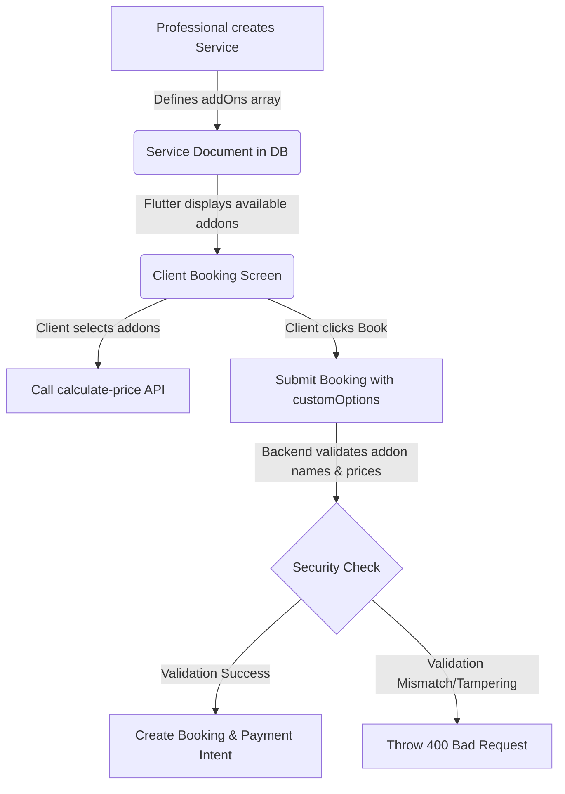

# Flutter Integration Guide: Service Add-ons & Custom Options

This guide explains how the **Add-on** (Custom Options) system is structured and how to integrate it into the Photopia Flutter application.

---

## 1. Concept Overview

The Add-on system operates in two stages:

1. **Service Definition (Professional/Provider):** The photographer defines the extra services they offer (e.g., *Drone Footage for €300*) inside their `Service` document in the `addOns` array.
2. **Booking Selection (Client/User):** When booking, the client selects from the service's predefined add-ons. These selected items are sent in the `Booking` payload as `customOptions`.



---

## 2. Dart Data Models

Copy these Dart classes directly into your models folder.

### Service Add-on Model (Service Side)
```dart
class ServiceAddOn {
  final String name;
  final double price;
  final String? description;

  ServiceAddOn({
    required this.name,
    required this.price,
    this.description,
  });

  factory ServiceAddOn.fromJson(Map<String, dynamic> json) {
    return ServiceAddOn(
      name: json['name'],
      price: (json['price'] as num).toDouble(),
      description: json['description'],
    );
  }

  Map<String, dynamic> toJson() {
    return {
      'name': name,
      'price': price,
      if (description != null) 'description': description,
    };
  }
}
```

### Booking Custom Option Model (Booking Side)
```dart
class BookingCustomOption {
  final String name;
  final double price;

  BookingCustomOption({
    required this.name,
    required this.price,
  });

  factory BookingCustomOption.fromJson(Map<String, dynamic> json) {
    return BookingCustomOption(
      name: json['name'],
      price: (json['price'] as num).toDouble(),
    );
  }

  Map<String, dynamic> toJson() {
    return {
      'name': name,
      'price': price,
    };
  }
}
```

---

## 3. Integration Step-by-Step

### Step A: Professional Defines Add-ons (Service Creation/Update)

When a Professional creates or edits their service using `multipart/form-data`, they pass the `addOns` list inside the JSON `data` field.

* **Endpoint:** `POST /services/` or `PATCH /services/:id`
* **JSON Payload Segment:**
```json
{
  "title": "Wedding Photography Premium",
  "price": 500,
  "pricingType": "PACKAGE",
  "addOns": [
    {
      "name": "Extra hour of coverage",
      "price": 150.0,
      "description": "Add an additional hour to the default coverage"
    },
    {
      "name": "Drone footage",
      "price": 300.0,
      "description": "Aerial drone photography and high-end video captures"
    },
    {
      "name": "Rush delivery (48h)",
      "price": 200.0,
      "description": "Receive edited pictures within 48 hours"
    }
  ]
}
```

---

### Step B: Live Price Estimation (Dynamic Check)

Before creating the final booking, the client selects/deselects add-ons on the screen. Calculate the live subtotal and deposit amount immediately by sending the selected addons to the price calculator.

* **Endpoint:** `POST /bookings/calculate-price`
* **Request Payload:**
```json
{
  "serviceId": "65f8a2b5...",
  "startTime": "14:00",
  "endTime": "16:00",
  "date": "2026-06-15",
  "distanceFromProviderKm": 5,
  "customOptions": [
    {
      "name": "Drone footage",
      "price": 300.0
    }
  ]
}
```
* **Response:**
The API will dynamically sum the selected `customOptions` into the `subtotal` and calculate deposit percentages.
```json
{
  "success": true,
  "statusCode": 200,
  "message": "Price calculated successfully",
  "data": {
    "pricingType": "HOURLY",
    "baseRate": 200,
    "travelFee": 0,
    "subtotal": 500, 
    "platformCommissionClient": 0.1,
    "clientTotal": 550,
    "customOptions": [
      { "name": "Drone footage", "price": 300 }
    ]
  }
}
```

---

### Step C: Creating the Booking (Security Check)

When booking, the client submits their order with the selected add-ons inside the `customOptions` array.

* **Endpoint:** `POST /bookings`
* **Request Payload:**
```json
{
  "serviceId": "65f8a2b5...",
  "providerId": "65f8a11a...",
  "bookingDate": "2026-06-15",
  "startTime": "14:00",
  "endTime": "16:00",
  "clientName": "John Doe",
  "clientEmail": "john@example.com",
  "eventLocation": {
    "address": "123 Main St",
    "city": "Berlin",
    "country": "Germany",
    "distanceFromProviderKm": 0
  },
  "customOptions": [
    {
      "name": "Drone footage",
      "price": 300.0
    }
  ]
}
```

---

## 4. Crucial Security Rules (Backend Validation)

The backend has **strict security validations** configured during booking creation to protect pricing:

1. **Existence Check:** If a client passes a custom option whose name is not defined in the service's `addOns` list, the backend rejects it.
   * *Example Error Response:*
     ```json
     {
       "success": false,
       "statusCode": 400,
       "message": "Add-on 'Rush delivery (48h)' is not offered for this service"
     }
     ```
2. **Price Modification Protection:** If a client passes an add-on but manually modifies the price (e.g. sending `price: 10` for an add-on that costs `300`), the backend rejects it.
   * *Example Error Response:*
     ```json
     {
       "success": false,
       "statusCode": 400,
       "message": "Invalid price for add-on 'Drone footage'. Expected: 300, got: 10"
     }
     ```

### 💡 Best Practice for Flutter Frontend:
Always map from the selected `ServiceAddOn` item's values directly to populate the `BookingCustomOption` map. **Never** allow the user to type in a custom price value.
