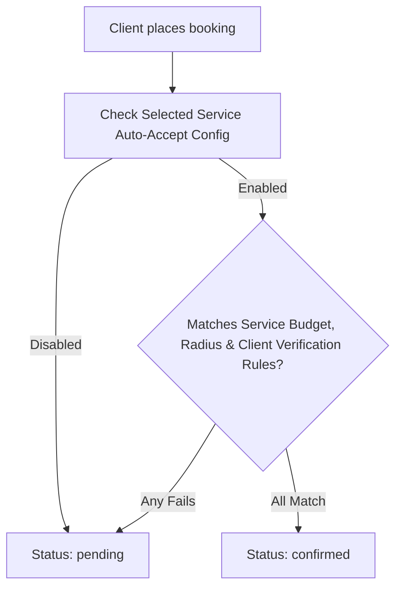

# Flutter Integration Guide: Per-Service Auto-Accept Bookings & Rules

This guide explains how to integrate the new **Per-Service Auto-Accept Bookings** feature and rules from the Flutter mobile app.

---

## 1. Feature Overview

Professionals can enable/disable **Auto-Accept Bookings** and configure rules **on a per-service level**. This means a professional can configure auto-accept criteria (Minimum Budget, Allowed Radius, and Client Verification requirements) uniquely for each different service they offer.

If a client's booking request matches all configured rules for that specific service, the booking is automatically set to `confirmed` without requiring manual review.

The rules are:
1. **Minimum budget:** Auto-accept only if the client total budget is greater than or equal to a specified budget (e.g., `€500`).
2. **Within radius:** Auto-accept only if the event location is within a specific distance (e.g., `30 km`).
3. **Verified clients only:** Auto-accept only if the booking client is a verified user (`verified: true`).



---

## 2. Service API: Get / Update Rules

These rules are stored directly on the **`Service`** model under the **`autoAcceptBookings`** field group.

### A. Service Data Schema (Dart Model Representation)
```dart
class AutoAcceptBookings {
  final bool enabled;
  final double? minimumBudget;
  final double? withinRadiusKm;
  final bool? verifiedClientsOnly;

  AutoAcceptBookings({
    required this.enabled,
    this.minimumBudget,
    this.withinRadiusKm,
    this.verifiedClientsOnly,
  });

  factory AutoAcceptBookings.fromJson(Map<String, dynamic> json) {
    return AutoAcceptBookings(
      enabled: json['enabled'] ?? false,
      minimumBudget: (json['minimumBudget'] as num?)?.toDouble(),
      withinRadiusKm: (json['withinRadiusKm'] as num?)?.toDouble(),
      verifiedClientsOnly: json['verifiedClientsOnly'] ?? false,
    );
  }

  Map<String, dynamic> toJson() {
    return {
      'enabled': enabled,
      'minimumBudget': minimumBudget,
      'withinRadiusKm': withinRadiusKm,
      'verifiedClientsOnly': verifiedClientsOnly,
    };
  }
}
```

### B. Creating / Updating a Service (POST / PATCH `/services`)

When creating a new service or updating an existing service from the professional's Service Management screen:

#### Request Payload Example:
```json
{
  "title": "Wedding Photography Gold Package",
  "price": 1200,
  "currency": "EUR",
  "pricingType": "PACKAGE",
  "autoAcceptBookings": {
    "enabled": true,
    "minimumBudget": 1000,
    "withinRadiusKm": 50,
    "verifiedClientsOnly": true
  }
}
```

---

## 3. Booking Creation Behavior (Client Flow)

When a client creates a booking, **the Flutter developer doesn't need to do anything extra on the Client App.** The backend will automatically handle the matching checks!

* **If matched:** The booking status returned will be `"status": "confirmed"`. You can direct the user directly to a success state.
* **If not matched:** The booking status returned will be `"status": "pending"`.
