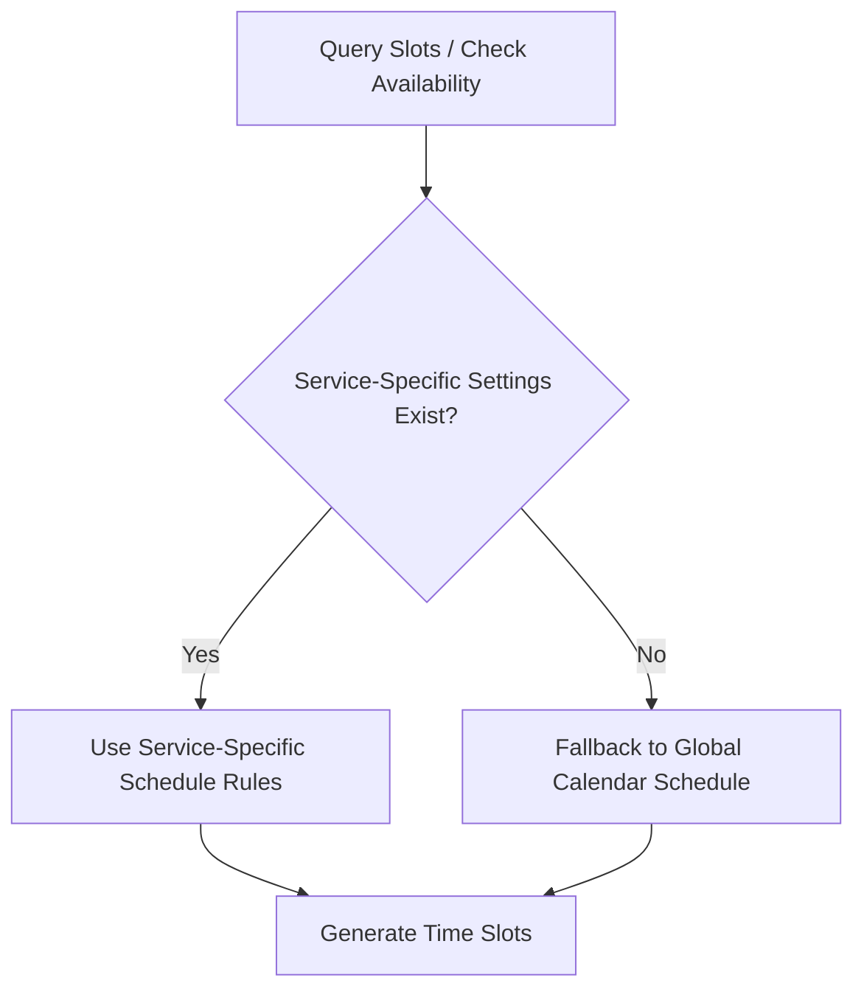

# Flutter Integration Guide: Dual-Level Availability Slots (Per-Service & Global)

This guide explains how to integrate the **Dual-Level Availability system** from the Flutter mobile app.

---

## 1. Feature Overview

Our backend supports two levels of scheduling and availability slots:
1. **Global Calendar Settings:** Manageable from Calendar Settings. Defines the provider's general work hours (e.g. Mon-Fri 09:00 - 18:00).
2. **Listing-specific (Per-Service) Availability:** Managed directly from the service creation/edit flow. Defines dates and slots specific to that listing (e.g., custom hours for specific packages).



---

## 2. API Reference & Flutter Integration

### A. Fetching Availability / Schedule
To load the availability settings on the professional's screen:

* **Get Global Availability:**
  ```http
  GET /availability/my-availability
  ```

* **Get Service-Specific Availability:**
  Pass the `serviceId` as a query parameter:
  ```http
  GET /availability/my-availability?serviceId=YOUR_SERVICE_ID
  ```

---

### B. Creating / Updating Availability & Schedule
When a professional saves availability on the screens:

* **Create / Update Global Availability:**
  ```http
  POST /availability/create-availability
  ```
  *Request Payload:*
  ```json
  {
    "defaultSchedule": {
      "monday": { "start": "09:00", "end": "18:00", "isActive": true, "maxBookings": 10 }
    }
  }
  ```

* **Create / Update Listing-Specific Availability:**
  Pass the `serviceId` inside the request body:
  ```http
  POST /availability/create-availability
  ```
  *Request Payload:*
  ```json
  {
    "serviceId": "YOUR_SERVICE_ID",
    "defaultSchedule": {
      "monday": { "start": "14:00", "end": "16:00", "isActive": true, "maxBookings": 10 }
    }
  }
  ```

---

### C. Fetching Available Time Slots for Clients
When a client is choosing date/time slots for a booking:

* **Query Available Slots:**
  Pass `serviceId` in the query parameter to automatically evaluate the correct override or fallback schedule:
  ```http
  GET /availability/slots/YOUR_PROVIDER_ID?date=2025-01-15&duration=60&serviceId=YOUR_SERVICE_ID
  ```
