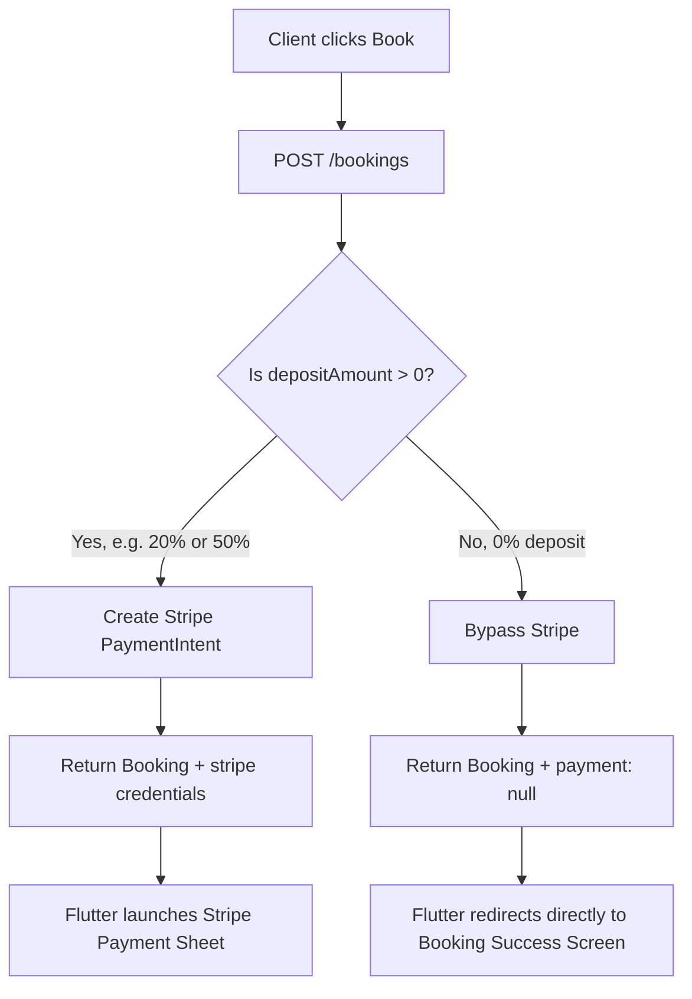

# Flutter Integration Guide: Dynamic Deposits & Stripe Payment Bypass (0% Deposit)

This guide documents how the backend's **dynamic deposit configuration** works and how the Flutter developer should integrate the new **0% upfront deposit flow** (which bypasses Stripe).

---

## 1. How It Works (Concept)

Previously, all bookings in the system required a fixed upfront deposit (e.g. 50% deposit), forcing the client to pay immediately through Stripe to confirm a booking.

Now, deposits are **dynamic and schema-driven**:
1. **0% Default:** When a Professional creates a service, the upfront deposit percentage defaults to **0%**.
2. **Dynamic Reading:** When booking, the backend reads the service's deposit configuration dynamically.
3. **Payment Bypass:** If the deposit amount is **€0 (0% deposit)**, the backend **bypasses Stripe PaymentIntent creation** entirely. It saves the booking in MongoDB and returns `payment: null` in the response.



---

## 2. Flutter UI Integration: Hiding the Dropdown

> [!IMPORTANT]
> **Client Request:** The client has explicitly requested to **hide the "Deposit Required" dropdown selection widget** from the UI during service creation and service updates. Professionals should not configure custom deposit percentages (0%, 20%, 25%, 50%) for now.

### What the Flutter Developer Should Do:
* Simply **remove or hide the Dropdown Widget** from the Service Creation and Edit screens.
* Do not send `depositPercentage` in the `POST /services/` or `PATCH /services/:id` payloads.
* The backend will automatically default `depositPercentage` to `0` (representing 0% deposit).

---

## 3. Flutter Code Integration: Handling Booking Responses

Since a 0% deposit service does not require upfront payment, the API response for `POST /bookings` will have a `payment: null` object. 

The Flutter developer **MUST** check for this to decide whether to launch the Stripe Payment Sheet or navigate directly to the Success screen.

### Dart/Flutter Integration Example:
```dart
import 'dart:convert';
import 'package:http/http.dart' as http;

Future<void> handleBookingCreation(Map<String, dynamic> bookingPayload) async {
  final url = Uri.parse('https://your-api-url.com/api/v1/bookings');
  
  final response = await http.post(
    url,
    headers: {
      'Content-Type': 'application/json',
      'Authorization': 'Bearer YOUR_JWT_TOKEN',
    },
    body: jsonEncode(bookingPayload),
  );

  if (response.statusCode == 201 || response.statusCode == 200) {
    final responseData = jsonDecode(response.body);
    final booking = responseData['data']['booking'];
    final payment = responseData['data']['payment'];

    // 💡 CRITICAL: CHECK IF STRIPE PAYMENT IS NULL (0% DEPOSIT BYPASS)
    if (payment == null) {
      print("0% deposit booking: Bypassing Stripe Payment Sheet.");
      // Redirect client directly to the Booking Success Screen!
      navigateToSuccessScreen(booking['bookingNumber']);
    } else {
      print("Upfront deposit required. Launching Stripe Sheet...");
      // Launch Stripe SDK with Stripe Credentials
      final clientSecret = payment['clientSecret'];
      final ephemeralKey = payment['ephemeralKey'];
      final customerId = payment['customerId'];
      
      await launchStripePaymentSheet(clientSecret, ephemeralKey, customerId);
    }
  } else {
    // Handle error (e.g. overlapping slots, outside radius, etc.)
    showErrorDialog(response.body);
  }
}
```

---

## 4. API Request & Response Payload Examples

### A. Booking Creation Request (POST `/bookings`)
```json
{
  "serviceId": "65f8a2b5...",
  "providerId": "65f8a11a...",
  "bookingDate": "2026-06-15",
  "startTime": "10:00",
  "endTime": "11:00",
  "clientName": "John Doe",
  "clientEmail": "john@example.com",
  "eventLocation": {
    "address": "123 Main St",
    "city": "Berlin",
    "country": "Germany",
    "distanceFromProviderKm": 0
  }
}
```

### B. Response Payload for 0% Deposit (Stripe Bypassed) ✅
```json
{
  "success": true,
  "statusCode": 201,
  "message": "Booking created successfully",
  "data": {
    "booking": {
      "_id": "66a10f84...",
      "bookingNumber": "BK-1789234",
      "clientId": "65f8a11a...",
      "providerId": "65f8a2b5...",
      "depositPercentage": 0,
      "depositAmount": 0,
      "balanceAmount": 110,
      "status": "pending",
      "paymentStatus": "pending"
    },
    "payment": null
  }
}
```

### C. Response Payload for Future Upfront Deposits (e.g., 20% or 50% Enabled Later)
If you decide to re-enable deposits in the future, the backend will automatically generate the credentials:
```json
{
  "success": true,
  "statusCode": 201,
  "message": "Booking created successfully",
  "data": {
    "booking": {
      "_id": "66a10f84...",
      "bookingNumber": "BK-1789234",
      "depositPercentage": 0.5,
      "depositAmount": 50,
      "balanceAmount": 60,
      "status": "pending",
      "paymentStatus": "pending"
    },
    "payment": {
      "paymentMode": "intent",
      "clientSecret": "pi_3M2w8G...",
      "paymentIntentId": "pi_3M2w8G",
      "ephemeralKey": "ek_test_...",
      "customerId": "cus_N7e...",
      "amount": 50,
      "currency": "EUR",
      "status": "requires_payment_method"
    }
  }
}
```
