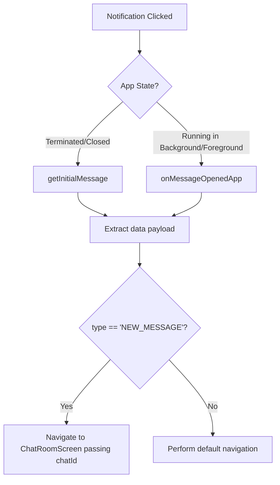

# 📱 Flutter FCM Redirect Guide: Handling Push Clicks for Direct Chat Navigation

This document explains how to handle Firebase Cloud Messaging (FCM) push notification clicks in the Flutter application to redirect users directly to their corresponding chat rooms.

---

## 📖 Payload Overview

When a user receives a new message push notification, the backend embeds relevant navigation details inside the **`data`** payload.

### API/FCM Data Payload Structure
```json
{
  "notificationId": "65f8d22...",
  "type": "NEW_MESSAGE",
  "chatId": "65f8d22ea1d09e7c5d99bfa2",
  "senderId": "67ba9e38d7065096181f08e4",
  "messagePreview": "Hey there! How is the project going?"
}
```

- **`type`**: Used to identify the context (e.g., `NEW_MESSAGE`, `SYSTEM_ALERT`, etc.).
- **`chatId`**: The database ID of the chat conversation. **Use this to load and open the chat screen directly.**
- **`senderId`**: The database ID of the user who sent the message.

---

## 🔄 Redirection Architecture Flow



---

## 🛠️ Step-by-Step Flutter Integration

Follow these steps to integrate the notification redirect handlers inside your main application entry point (e.g., `main.dart` or your home controller).

### Step 1: Create the Navigation Handler Method
Create a centralized method in your routing system or main class to parse and handle notification click data:

```dart
import 'package:flutter/material.dart';

void handleNotificationRedirect(BuildContext context, Map<String, dynamic> data) {
  final String? type = data['type'];
  final String? chatId = data['chatId'];
  final String? senderId = data['senderId'];

  if (type == 'NEW_MESSAGE' && chatId != null) {
    // Navigate to Chat Detail screen and pass the chatId
    Navigator.pushNamed(
      context,
      '/chat-details', // Make sure this matches your router config
      arguments: {
        'chatId': chatId,
        'senderId': senderId,
      },
    );
  }
}
```

---

### Step 2: Handle Redirection When the App is Running (Background / Foreground)
Listen for push clicks while the app is active in the background or foreground by adding `onMessageOpenedApp` listener inside your initialization method:

```dart
import 'package:firebase_messaging/firebase_messaging.dart';

void setupNotificationListeners(BuildContext context) {
  // Triggers when user clicks on a push notification and the app is in background/foreground
  FirebaseMessaging.onMessageOpenedApp.listen((RemoteMessage message) {
    print("Push notification clicked while app is running: ${message.data}");
    handleNotificationRedirect(context, message.data);
  });
}
```

---

### Step 3: Handle Redirection When the App is Closed (Cold Start / Terminated)
If the app was completely closed, clicking the notification will launch it. Check `getInitialMessage()` when the app launches (e.g., inside the `initState` of your main screen, Splash screen, or Auth state listener):

```dart
import 'package:flutter/material.dart';
import 'package:firebase_messaging/firebase_messaging.dart';

class MainNavigationWrapper extends StatefulWidget {
  const MainNavigationWrapper({Key? key}) : super(key: key);

  @override
  _MainNavigationWrapperState createState() => _MainNavigationWrapperState();
}

class _MainNavigationWrapperState extends State<MainNavigationWrapper> {
  @override
  void initState() {
    super.initState();
    
    // 1. Setup active listeners for background click events
    setupNotificationListeners(context);

    // 2. Check if the app was opened via a push notification click from terminated state
    _checkForInitialMessage();
  }

  Future<void> _checkForInitialMessage() async {
    // Get message that caused the app to open
    RemoteMessage? initialMessage = await FirebaseMessaging.instance.getInitialMessage();
    
    if (initialMessage != null) {
      print("App opened from terminated state via push click: ${initialMessage.data}");
      // Small delay to ensure the navigator is fully mounted before pushing
      Future.delayed(const Duration(milliseconds: 500), () {
        if (mounted) {
          handleNotificationRedirect(context, initialMessage.data);
        }
      });
    }
  }

  @override
  Widget build(BuildContext context) {
    return const Scaffold(
      body: Center(
        child: CircularProgressIndicator(),
      ),
    );
  }
}
```
