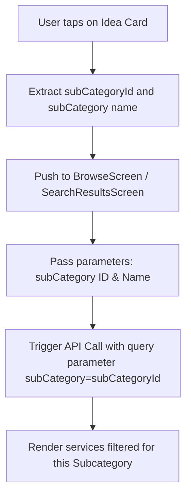

# 🏠 Project Ideas Integration Guide: Home Page UI & API Flow

This document details how the **Project Ideas** (formerly known as Inspirations or Idea Cards) should be integrated, rendered, and navigated within the mobile application (Flutter) home page.

---

## 📖 Feature Overview
Project Ideas are interactive cards displayed on the Home Page to inspire users and direct them to specific service subcategories. 
Each card consists of:
1. **Title/Question**: A catchy question or text with emojis (e.g., `"Are 🏠 you planning a wedding? 💍"`).
2. **Action Text (Link)**: A clickable call-to-action link text (e.g., `"See our wedding packages"`).
3. **Subcategory Reference**: A link to a specific `SubCategory` in the database. When clicked, it navigates the user to the services page pre-filtered by that subcategory.

---

## 🔌 API Integration

The Project Ideas list is delivered dynamically as part of the unified Home API.

### Endpoint
- **URL**: `GET /api/v1/home`
- **Headers**: 
  - `Authorization: Bearer <JWT_TOKEN>` (Optional)
- **Response Key**: `data.ideas` (Array of Project Ideas sorted by `order`)

### Sample API Response Payload
```json
{
  "success": true,
  "message": "Home data retrieved successfully",
  "data": {
    "ideas": [
      {
        "_id": "6a3c25858a8cfeb870a2c511",
        "title": "Are 🏠 you planning a wedding? 💍",
        "linkText": "See our wedding packages",
        "subCategoryId": {
          "_id": "69f662050f2f322ec6ede0fa",
          "name": "Wedding",
          "theme": "PHOTOGRAPHY",
          "parent": "69f660ac0f2f322ec6eddff3",
          "type": "subcategory",
          "isActive": true
        },
        "order": 1,
        "createdAt": "2026-06-24T18:44:21.023Z",
        "updatedAt": "2026-06-24T18:44:21.023Z"
      },
      {
        "_id": "6a3c25858a8cfeb870a2c512",
        "title": "Expecting a new family member? 👶",
        "linkText": "Book newborn & maternity session",
        "subCategoryId": {
          "_id": "69f6609d0f2f322ec6eddfe9",
          "name": "Newborn & maternity portrait",
          "theme": "PHOTOGRAPHY",
          "parent": "69f660160f2f322ec6eddf96",
          "type": "subcategory",
          "isActive": true
        },
        "order": 2,
        "createdAt": "2026-06-24T18:44:21.024Z",
        "updatedAt": "2026-06-24T18:44:21.024Z"
      }
    ]
  }
}
```

---

## 🎨 UI & Layout Guidelines (Flutter)

### 1. Positioning on Home Screen
The **Project Ideas** section should be placed as a horizontal scrolling list (Carousel or ListView) near the middle or bottom of the Home Screen—usually below **Trending This Week** or **Super Pros** sections.

### 2. Card Design Specs (Premium Look)
- **Container**: Card with subtle rounded corners (`borderRadius: 16.0`), padding (`16.0`), and a modern card background.
- **Background style options**:
  - **Glassmorphism**: Semi-transparent background with a blur filter and thin border.
  - **Soft Gradients**: Using the parent category's theme or general premium gradients (e.g., Deep indigo to soft purple).
- **Text Hierarchy**:
  - **Title (Main Question)**: Large font (`fontSize: 18`, `fontWeight: Bold`), high contrast color.
  - **Link Text (Action)**: Underlined or accompanied by an arrow icon (`→`), colored with the app's primary brand color (e.g. Amber/Gold or Indigo), indicating it's clickable.
- **Emoji support**: Ensure the font handles emojis perfectly (e.g., 🏠, 💍, 👶) as they make the cards visually engaging.

```
+-------------------------------------------------+
|                                                 |
|  Are 🏠 you planning a wedding? 💍             |
|                                                 |
|  See our wedding packages  →                     |
|                                                 |
+-------------------------------------------------+
```

---

## 🔄 User Navigation Flow & Parameter Mapping

When a user taps on a **Project Idea** card or its link text, the app should navigate to the Service Listing / Browse screen with the subcategory filter automatically applied.

### Target API Endpoint for Filtering
To fetch services under the selected subcategory, make the following network request:
- **URL**: `GET /api/v1/services`
- **Query Parameters**:
  - `subCategory`: `<subCategoryId>` (e.g. `69f662050f2f322ec6ede0fa` - **Note the exact spelling: camelCase with no "Id" suffix**)
  - `isActive`: `true` (To ensure only active services are loaded)
  - `status`: `ACTIVE` (To filter out pending, inactive, or archived services)

**Example complete URL**:
```http
GET /api/v1/services?subCategory=69f662050f2f322ec6ede0fa&isActive=true&status=ACTIVE
```

### Flow Chart


---

## 🛠️ Step-by-Step Flutter Code Integration Instruction

### Step 1: Parse the API Response with Dart Model

Define the `ProjectIdea` model exactly as below to ensure nested fields like `subCategoryId` are processed correctly:

```dart
class ProjectIdea {
  final String id;
  final String title;
  final String linkText;
  final String subCategoryId;
  final String subCategoryName;
  final int order;

  ProjectIdea({
    required this.id,
    required this.title,
    required this.linkText,
    required this.subCategoryId,
    required this.subCategoryName,
    required this.order,
  });

  factory ProjectIdea.fromJson(Map<String, dynamic> json) {
    final subCategory = json['subCategoryId'] as Map<String, dynamic>;
    return ProjectIdea(
      id: json['_id'] as String,
      title: json['title'] as String,
      linkText: json['linkText'] as String,
      subCategoryId: subCategory['_id'] as String,
      subCategoryName: subCategory['name'] as String,
      order: json['order'] as int? ?? 0,
    );
  }
}
```

### Step 2: Handle onTap Navigation Event

When building the UI Card widget, use the `GestureDetector` or `InkWell` to capture click events:

```dart
Widget buildProjectIdeaCard(BuildContext context, ProjectIdea idea) {
  return Card(
    elevation: 2,
    shape: RoundedRectangleBorder(borderRadius: BorderRadius.circular(16)),
    child: InkWell(
      borderRadius: BorderRadius.circular(16),
      onTap: () {
        // Navigate to Browse screen with subcategory filter parameters
        Navigator.pushNamed(
          context,
          '/browse-services',
          arguments: {
            'subCategory': idea.subCategoryId,
            'subCategoryName': idea.subCategoryName,
          },
        );
      },
      child: Padding(
        padding: const EdgeInsets.all(16.0),
        child: Column(
          crossAxisAlignment: CrossAxisAlignment.start,
          children: [
            Text(
              idea.title,
              style: const TextStyle(
                fontSize: 18,
                fontWeight: FontWeight.bold,
              ),
            ),
            const SizedBox(height: 12),
            Row(
              children: [
                Text(
                  idea.linkText,
                  style: const TextStyle(
                    color: Colors.blueAccent,
                    fontWeight: FontWeight.w600,
                    decoration: TextDecoration.underline,
                  ),
                ),
                const SizedBox(width: 4),
                const Icon(
                  Icons.arrow_forward,
                  size: 16,
                  color: Colors.blueAccent,
                ),
              ],
            ),
          ],
        ),
      ),
    ),
  );
}
```

### Step 3: Fetch Data on target screen (`BrowseServicesScreen`)

Inside the controller or state of the page navigating to, extract the arguments and perform the filtered API request:

```dart
class BrowseServicesScreen extends StatefulWidget {
  const BrowseServicesScreen({Key? key}) : super(key: key);

  @override
  _BrowseServicesScreenState createState() => _BrowseServicesScreenState();
}

class _BrowseServicesScreenState extends State<BrowseServicesScreen> {
  List<dynamic> _services = [];
  bool _isLoading = true;

  @override
  void didChangeDependencies() {
    super.didChangeDependencies();
    
    // Extract route arguments
    final arguments = ModalRoute.of(context)?.settings.arguments as Map<String, dynamic>?;
    final String? subCategoryId = arguments?['subCategory'];
    
    // Call the API with subCategory parameter
    _fetchFilteredServices(subCategoryId);
  }

  Future<void> _fetchFilteredServices(String? subCategoryId) async {
    setState(() {
      _isLoading = true;
    });

    try {
      // Build request query parameters (Use EXACT parameter name: subCategory)
      String url = 'https://api.photopya.com/api/v1/services?isActive=true&status=ACTIVE';
      if (subCategoryId != null) {
        url += '&subCategory=$subCategoryId';
      }

      final response = await http.get(Uri.parse(url), headers: {
        'Content-Type': 'application/json',
      });

      if (response.statusCode == 200) {
        final data = json.decode(response.body);
        setState(() {
          _services = data['data']['result'] ?? [];
          _isLoading = false;
        });
      } else {
        // Handle error
      }
    } catch (e) {
      // Handle error
    }
  }

  @override
  Widget build(BuildContext context) {
    // Render filtered services list...
  }
}
```
